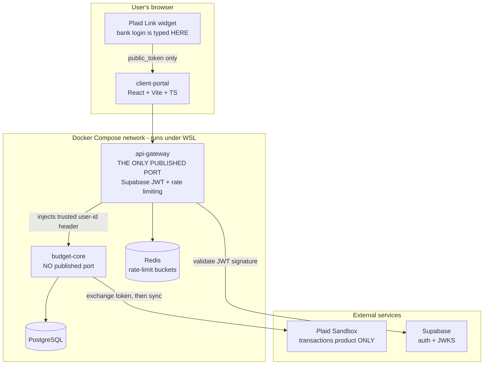
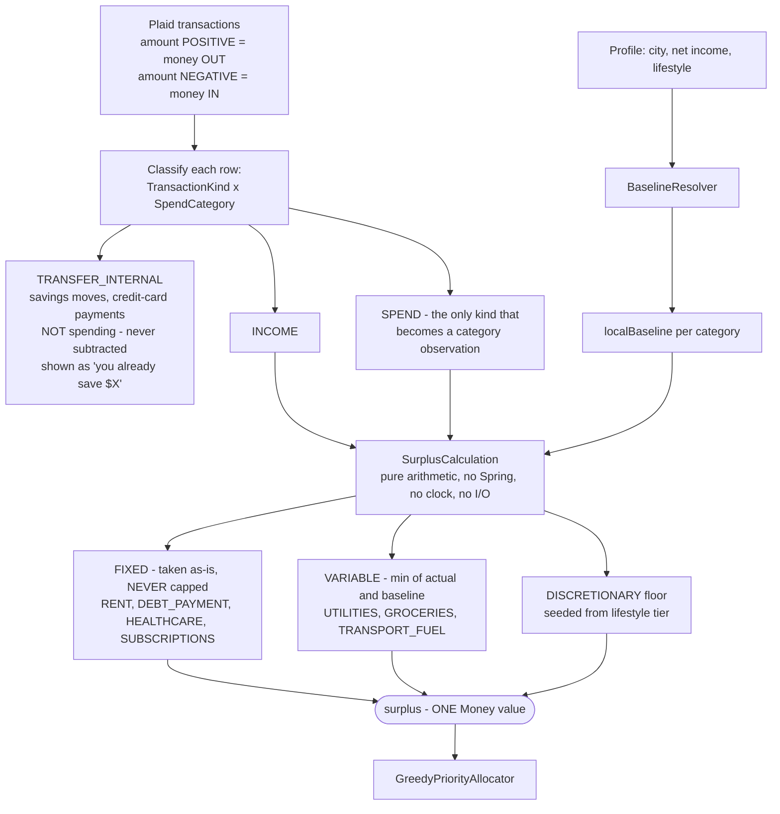
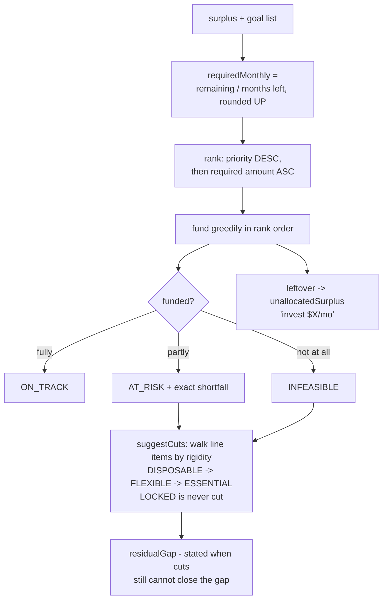
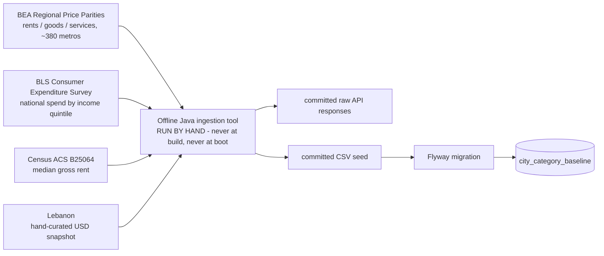
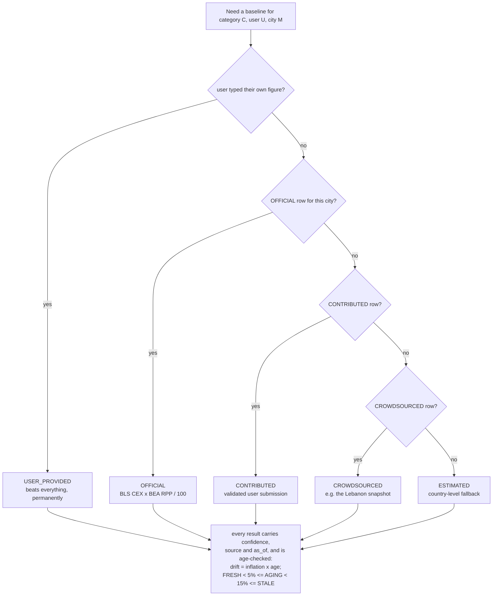
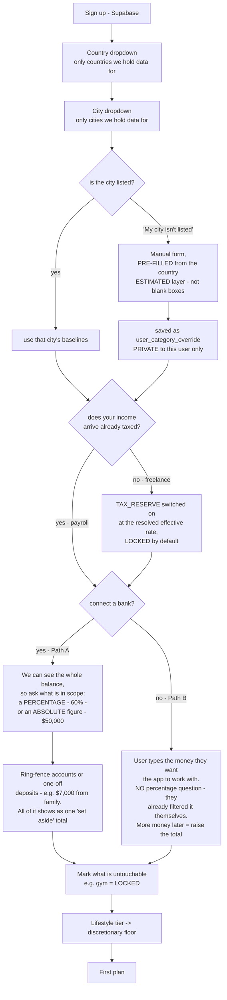
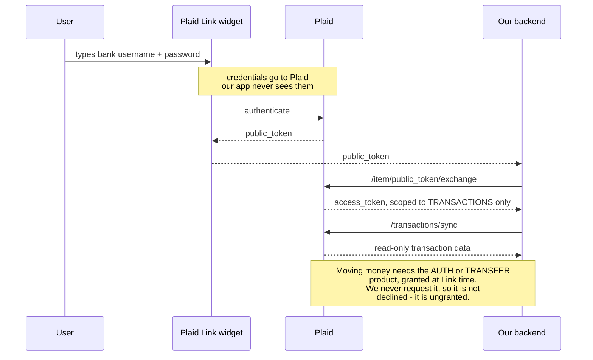
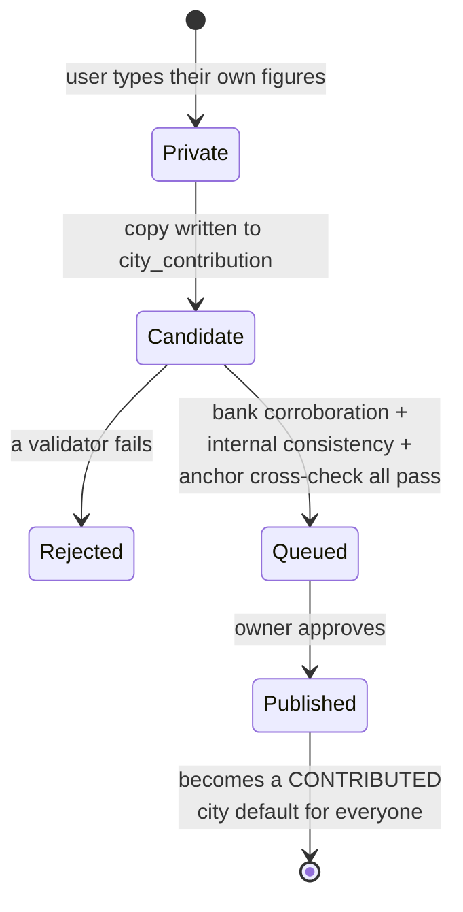
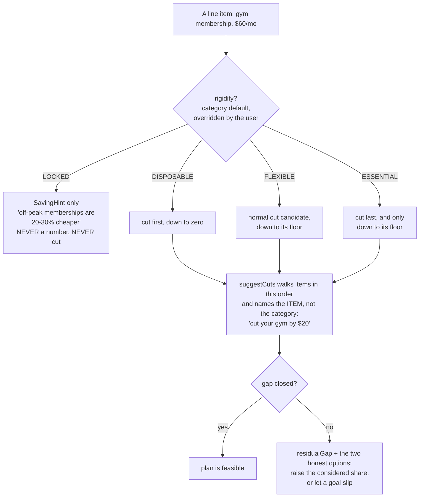

# Financial Balancer — Architecture, Purpose and Build Plan

This document is the authoritative design record. It is written to be self-contained: handing it to
a fresh collaborator (human or AI) should be enough to resume work without re-deriving decisions.

`README.md` is the public-facing pitch. `CLAUDE.md` holds environment and build commands. **This
file holds the reasoning.** Where they disagree, this file wins and the others should be corrected.

Diagrams are Mermaid and render natively on GitHub.

---

## 1. Purpose

Most budgeting apps tell you what you **spent**. This one tells you what to **do**, and re-answers
the moment your goals change.

The differentiator is not tracking, categorisation, or charts — every free app has those. It is the
**recompute-with-tradeoffs loop**: you add a goal, and the app immediately tells you what it costs
you elsewhere, in dollars, judged against your own city rather than a national rule of thumb.

Target user: a single person (not a household) with an income, a city, and goals.

### Features

| ID | Feature | State |
|---|---|---|
| F1 | Account, profile, city, income, lifestyle tier | Designed |
| F2 | Bank connection and transaction import, strictly read-only | Designed |
| F3 | Cost-of-living benchmark against the user's own city | Designed |
| F4 | Monthly plan: fixed / flexible / discretionary / surplus | Designed |
| F5 | Goals, recompute, and tradeoffs | **Built, 27 tests passing** |
| F6 | Investment surface, deliberately minimal | Designed |
| F7 | Plan history via append-only snapshots | Designed |
| F8 | "Can I afford this meal right now?" with a catch-up plan | **Built, 33 tests passing** |
| F9 | Budget rebalancing with user-assigned rigidity tiers | **Built, 27 tests passing** |

### Explicitly out of scope

Moving or investing real money; real bank accounts; specific security recommendations;
multi-currency; progressive tax modelling; households and dependents. These belong in the README as
stated gaps, not hidden ones.

---

## 2. Overriding design principle

**Changes must stay cheap.** Adding a feature or adjusting one should not become an archaeology
exercise. This is a constraint on every decision below, not a platitude. Concretely:

- **Anything external sits behind a port**, and every port in this design has at least two real
  implementations — never one imagined one.
- **Policy lives in lookup data**, not in branches. Adding a category, a hint, or a price band is
  one row.
- **The domain stays framework-free.** No Spring, no JPA, no I/O, no clock. That is what makes it
  exhaustively testable in milliseconds.
- **Guard the narrow seam.** The allocator consumes a single `surplus` value plus a goal list. It
  knows nothing about cities, Plaid, balances, or HTTP. Everything upstream can be rewritten without
  touching it.

The working test for any proposed change: *can the cost-of-living data source be replaced without
touching the allocator?* If that ever becomes "no", the design has regressed.

---

## 3. What runs where



`budget-core` has **no published port**. This is load-bearing, not tidiness: it trusts the user-id
header the gateway injects, so if it were reachable directly, anyone could forge that header and
read another user's bank data. `docker-compose.yml` must carry a comment saying so, because that is
exactly the line a future change deletes "to make local testing easier".

### Service boundaries, and the ones that were cut

Six services were designed. Three were removed. Each boundary had to survive *"what breaks if this
is a package instead of a process?"*

| Component | Verdict | Reasoning |
|---|---|---|
| `budget-core` | Keep | It is the product. Modular monolith inside. |
| `client-portal` | Keep | The tradeoff loop is only legible visually. A frontend, not a service. |
| `api-gateway` | Keep | Reused from `jobs-tracker-distributed-system`. Auth + rate limiting in front of bank data. |
| `transaction-ingestion` | **Module, not a process** | The real requirement is "a sync must never sit in a request path", satisfied by `@Async`. A second JVM buys a network hop and a distributed transaction at one user. Build the hard parts anyway: durable cursor, webhook idempotency, `TRANSACTIONS_REMOVED`. |
| `analytics-engine` | **Cut** | "OLAP aggregation" over ~2,000 sandbox rows is a claim that loses under questioning. A monthly trend is `GROUP BY date_trunc`. |
| `ai-enrichment` | **Cut from the critical path** | No money decision may come from a model. What remains is one service with a cache, a timeout and a fallback. |

The removals are a selling point, not an embarrassment. A reviewer reads "six services, solo, two
weeks" as a negative judgment signal. What remains is a modular monolith whose boundaries are
enforced mechanically by ArchUnit, so extracting a service later is a build decision, not a rewrite.

To keep that claim honest: **each module owns its tables, no foreign keys cross module boundaries,
and no module autowires another module's repository.**

### Reuse rule

The `jobs-tracker-distributed-system` repository is **read-only**. Copy its gateway files in and
adapt the copies. Never edit or commit to that repository, even for something that looks improvable
in passing.

---

## 4. Package structure

```
com.hasan.budget
├── shared/            Money, SpendCategory (+ Commitment, CutSpeed, BaselinePolicy),
│                      Rigidity, TransactionKind, Confidence
├── profile/           domain (UserProfile, LifestyleTier, IncomeQuintile) | application
│                      | persistence | web
├── costofliving/
│   ├── domain/        ResolvedBaseline, Staleness, PriceComponent, MetroId
│   ├── port/          CostOfLivingProvider            ← framework-free interface
│   ├── classpath/     ClasspathCostOfLivingProvider   ← adapter 1, committed CSV
│   ├── persistence/   JpaCostOfLivingProvider         ← adapter 2
│   ├── application/   BaselineResolver, CityCatalogService, ContributionValidator
│   └── web/
├── planning/
│   ├── domain/        UNCHANGED allocator + model
│   │   └── surplus/   SurplusInput, CategoryObservation, CategoryLine,
│   │                  SurplusBreakdown, SurplusCalculation   ← pure, no Spring
│   ├── application/   PlanAssembler, PlanService
│   ├── persistence/
│   └── web/
└── ingestion/         domain | port (BankDataProvider) | plaid | application
                       | persistence | web
```

Two mechanisms keep `planning.domain` framework-free while `costofliving` uses JPA:

1. **`planning.domain` never imports `costofliving` at all.** `PlanAssembler` is the sole
   translator. It receives `ResolvedBaseline` objects carrying confidence and provenance, and
   flattens them to bare `Money` before the math sees them. **Confidence travels to the view, never
   into the formula** — because the moment the math can see it, someone writes
   `if (confidence == ESTIMATED)` inside the calculation and the branch sprawl begins.
2. **The port and its return types are framework-free.** JPA entities never escape
   `costofliving.persistence`.

`SurplusCalculation` lives in `planning.domain.surplus`, not in a `@Service`. It is pure arithmetic,
it is the piece most likely to be wrong — it already was once — and putting it in a service would
make it require a Spring context to test, which is how that bug class survives.

---

## 5. How the money flows



### The formula, and the bug it was nearly built on

The naive version is `housingCap = income × 0.30 × (cityIndex / 100)`. It is **wrong**. With San
Francisco's rent parity near 180 it "recommends" 54% of income on rent. **A cost-of-living index
says what things cost, not what you should spend.** Conflating the two makes the headline feature
produce nonsense.

Two separate jobs:

```
localBaseline(category) = BLS_CEX(category, income quintile) × RPP_component(metro) / 100

surplus = income
        − fixedCommitments                 (taken as-is, never capped)
        − Σ min(actual, localBaseline)     (flexible essentials only)
        − discretionaryFloor               (quality-of-life minimum)
```

**Job 1 — benchmark (descriptive):** compare actual spend to `localBaseline`, report position, never
prescribe. **Job 2 — plan (prescriptive):** the surplus formula above.

Fixed commitments are never capped because you cannot cap a lease mid-month. Only genuinely
controllable spending is measured against a baseline. This is what makes the headline claim
truthful: *"your rent is $300/mo above local baseline — that is what pushes your car goal out by two
months."*

### Plaid sign convention

> *"Positive values when money moves out of the account; negative values when money moves in."*

A $700 deposit arrives as `amount = -700` and must be flipped for display. Getting this backwards
inverts every number in the product, silently. It needs a named test on day one.

---

## 6. Goals, ranking and tradeoffs — the built part



**Why greedy is optimal.** The surplus is a single divisible, homogeneous resource, so this is not a
multi-dimensional knapsack. For the objective *maximise the priority-weighted count of goals kept on
pace*, greedy in this order is optimal by exchange argument: given a funded goal and an unfunded goal
that outranks it, moving the funding never reduces the priority-weighted count. `O(n log n)`.

**Why cheapest-first within a tier.** With $300 and three equal-priority goals needing
$100/$150/$300, cheapest-first keeps two on pace; largest-first keeps one. A test fails if this is
reversed.

**Stated limitation.** This solves one month in isolation. Multi-period catch-up is a different
problem; `AllocationStrategy` exists so an LP allocator can replace it without touching callers.

---

## 7. Category taxonomy — two axes, plus a third owned by the user

`SpendCategory` carries its own policy as attached metadata, so adding a category is one enum row.

| Category | Commitment | Cut speed | Baseline policy | RPP component | Default rigidity |
|---|---|---|---|---|---|
| `RENT` | FIXED | NOT_SHORT_TERM | TAKE_AS_IS | RENTS | LOCKED |
| `DEBT_PAYMENT` | FIXED | NOT_SHORT_TERM | TAKE_AS_IS | — | LOCKED |
| `TAX_RESERVE` | FIXED | NOT_SHORT_TERM | TAKE_AS_IS | — | LOCKED |
| `HEALTHCARE` | FIXED | SLOW | TAKE_AS_IS | OTHER_SERVICES | ESSENTIAL |
| `SUBSCRIPTIONS` | FIXED | IMMEDIATE | TAKE_AS_IS | OTHER_SERVICES | ESSENTIAL |
| `UTILITIES` | VARIABLE | PARTIAL | CAP_AT_BASELINE | OTHER_SERVICES | ESSENTIAL |
| `GROCERIES` | VARIABLE | PARTIAL | CAP_AT_BASELINE | GOODS | ESSENTIAL |
| `TRANSPORT_FUEL` | VARIABLE | PARTIAL | CAP_AT_BASELINE | GOODS | ESSENTIAL |
| `DINING_OUT` | VARIABLE | IMMEDIATE | DISCRETIONARY | OTHER_SERVICES | FLEXIBLE |
| `ENTERTAINMENT` | VARIABLE | IMMEDIATE | DISCRETIONARY | OTHER_SERVICES | DISPOSABLE |
| `CLOTHING` | VARIABLE | IMMEDIATE | DISCRETIONARY | GOODS | FLEXIBLE |
| `OTHER` | VARIABLE | IMMEDIATE | DISCRETIONARY | OTHER_SERVICES | FLEXIBLE |

`SurplusCalculation` holds exactly one switch — over `BaselinePolicy`, three arms — never over
`SpendCategory`.

Three deliberate calls:

- **`DEBT_PAYMENT` is necessary.** A car or student loan is often the largest fixed outflow after
  rent for the target user. An app that cannot represent one does not function in the real world.
- **`SUBSCRIPTIONS` is `TAKE_AS_IS` *and* cuttable.** This is why the axes must be independent: it
  is subtracted at full observed value because you are paying it this month, and it is
  simultaneously a cut candidate. A single flexibility rank cannot express that.
- **`OTHER` is never auto-suggested for cuts.** *"Cut $150 from Other"* is advice nobody can act on.
  It still counts as discretionary; it is simply never proposed.

### Rigidity — the user's axis

Rigid vs flexible is not a property of a category. It is a property of **this user's relationship
to** an expense. A gym membership is discretionary in general and untouchable for someone who trains
daily.

| Rigidity | User's words | What the engine may do |
|---|---|---|
| `DISPOSABLE` | "not very important" | Cut first, down to zero |
| `FLEXIBLE` | "flexible" | Normal cut candidate, down to its floor |
| `ESSENTIAL` | "very important" | Cut last, and only to its floor |
| `LOCKED` | "cannot be changed" | **Never** cut or raised. Hints only. |

The enum is ordered, so **rigidity replaces a separate cut rank** — one concept, not two, with the
category default breaking ties. Defaults come from the table above; the user's override is private
to their account.

### Hints, for what the engine may not cut

A `LOCKED` line never produces a `Tradeoff`. It produces a **`SavingHint`** — qualitative, and never
part of the arithmetic:

- `RENT` → "a roommate or a lease renegotiation is the only real lever here"
- `UTILITIES` → "off-peak tariffs and LED replacement typically cut 10–15%"
- a locked gym membership → "off-peak or annual-paid memberships are usually 20–30% cheaper"

Hints are lookup data, one row each. Keeping them non-numeric is what stops a tip from silently
becoming a number in the plan.

### Line items — cuts name the gym, not the category

```
user_line_item(user_id, id, label, category, monthly_amount, rigidity)
```

Advice reads *"cut your gym by $20"*, not *"cut Entertainment by $20"*. `DiscretionarySpend` becomes
`(id, label, SpendCategory, Money, Rigidity)` and `Tradeoff` gains the label. **This changes the
existing allocator tests** — scheduled work, not a free refactor.

### Transfers — the double-count bug

The root error is treating *kind of money movement* as a value of *spend category*.

```java
enum TransactionKind { SPEND, TRANSFER_INTERNAL, TRANSFER_EXTERNAL, INCOME, REFUND, FEE }
record Classification(TransactionKind kind, SpendCategory category) // category null unless SPEND
```

Only `kind == SPEND` becomes a `CategoryObservation`. `TRANSFER_INTERNAL` aggregates into
`alreadySaving`, which is **displayed** but never subtracted, so it flows into surplus.

- `TRANSFER_OUT_SAVINGS`, `TRANSFER_*_ACCOUNT_TRANSFER` → `TRANSFER_INTERNAL`
- **`LOAN_PAYMENTS_CREDIT_CARD_PAYMENT` → `TRANSFER_INTERNAL`.** This is the bug that actually
  bites: buy groceries on a card, pay the card, and the groceries are counted twice. Distinct from
  `DEBT_PAYMENT`, which is a real outflow to a lender.
- `INCOME_*`, `TRANSFER_IN_DEPOSIT` → `INCOME`; `BANK_FEES_*` → `FEE`; everything else → `SPEND`.

**Pair collapsing:** within one Plaid Item, match opposite-sign amounts of equal magnitude within
±3 days and collapse. Named tests: `creditCardPaymentIsNotCountedAsSpend`,
`internalTransferPairIsCollapsed`.

---

## 8. Cost-of-living data

> **Deferred as of v1.** The BLS/BEA/Census derivation described in this section is **not built**.
> v1 ships curated figures for about ten cities, labelled `CROWDSOURCED`. The reasoning, the full
> specification and the reference data are in
> `.claude/packets/P9-DEFERRED-official-cost-of-living.md`. The rest of this section is retained
> because it documents the design the port was built to accept — the `OFFICIAL` confidence tier and
> an empty `OFFICIAL` resolver layer both exist so reviving it is a new class, not a refactor.
> `city_category_baseline.income_quintile` must stay **nullable** for that to hold.

### Sources, and why nothing is fetched at runtime



No arrow runs from a government API into the running app. The network can never fail a build, a
test, or a demo — which matters because this machine's DNS drops intermittently.

### Schema

```sql
country(code PK, name, currency, annual_inflation_pct, inflation_as_of, data_note, listed)
metro_area(id PK, country_code FK, slug UNIQUE, display_name, admin1,
           external_geo_id, population, sort_rank)
data_source(id PK, name, url, retrieved_at, license_note)

-- inputs of record, kept for audit and re-derivation
national_baseline(country_code, category, income_quintile, monthly_amount, source_id, as_of)
price_level(metro_id, component, index_value, source_id, as_of)   -- RENTS|GOODS|OTHER_SERVICES
country_tax_rate(country_code, effective_rate, source_id, as_of)

-- the read path, materialised
city_category_baseline(metro_id, category, income_quintile, monthly_amount,
                       confidence, source_id, as_of, derivation)

-- user layer, all private to the user
user_category_override(user_id, category, monthly_amount, set_at, corroboration)
user_tax_override(user_id, effective_rate, set_at)
user_line_item(user_id, id, label, category, monthly_amount, rigidity)
user_manual_location(user_id, country_code, city_label)   -- label is DISPLAY ONLY
city_contribution(id, metro_id_or_label, country_code, user_id, category,
                  monthly_amount, submitted_at, validation_state, validation_notes)
```

Two decisions worth defending:

**Materialise `city_category_baseline`** rather than computing `CEX × RPP/100` per request. The US
path has an index to multiply by; Lebanon has none. Computing at read time grows a branch per
country on the hot path. Materialising makes both countries one table, one query, one adapter; the
formula runs once, in a tested ingestion job, and `derivation` keeps the audit trail
(`"CEX(HOUSING,q3) 1842.00 × RPP_RENTS 178.2/100"`). Cost, stated honestly: a formula change means
re-running the job and shipping a new seed migration. Reproducibility beats convenience for a number
this easy to get silently wrong.

**`city_label` is display-only and never a lookup key.** That kills geocoding and fuzzy matching
dead: a typed city name can never almost-match the wrong metro.

### Which number wins



An **ordered list of layers in code**, not nested ifs. Adding a data source appends one layer. The
same chain resolves the tax rate.

`CostOfLivingProvider` **never returns a bare `Money`** — always a `ResolvedBaseline` carrying
confidence, source and `as_of`. A bare number loses provenance, and then the UI cannot label
anything honestly.

Responsibility split: the **port** answers "what does this place cost" (layers 2–5); the
**resolver** composes the user override on top. That keeps the data adapter genuinely substitutable.

### Staleness is derived, not hardcoded

```
driftPct = country.annual_inflation_pct × monthsBetween(as_of, today) / 12
FRESH < 5% ≤ AGING < 15% ≤ STALE
```

The US at ~3%/yr stays FRESH for 20 months. Lebanon at 17.3%/yr turns AGING in ~3.5 months and STALE
in ~10. Same code, opposite behaviour, one column.

**Never auto-inflate stored figures** — that fabricates precision. Show the banner, and offer the
inflation-adjusted number as the *pre-filled default* in the override form so the user confirms it
and it becomes `USER_PROVIDED` rather than a machine guess wearing a `CROWDSOURCED` badge.

### Why Lebanon works without multi-currency

Lebanon has been de facto USD-priced since the 2019 collapse — rents and most prices are quoted in
dollars, salaries increasingly so. Lebanese cities therefore store in the same units as US metros
with no FX layer. There is no RPP equivalent (CAS publishes only a national CPI), so Lebanese rows
carry **absolute USD figures** at `CROWDSOURCED` confidence with an explicit `as_of`.

Honest seam: Lebanon is dual-currency in practice — rent and groceries in USD, utilities and
government fees still in LBP. `Money` has no currency field. *"All amounts USD; Lebanese figures are
USD-equivalent snapshots"* is defensible if stated. Do not add a currency field until there is a
second implementation.

---

## 9. Onboarding and the considered balance



### Two entry paths

Money reaches the app one of two ways, and the considered-share question belongs to only the first.

**Path A — bank connected.** We can see the whole balance, including money the user never chose to
show us, so we must ask what is in scope:

```
consideredBalance = min( stated , Σ non-excluded balances − ring-fenced )   -- ABSOLUTE, "$50,000"
consideredBalance = ( Σ non-excluded balances − ring-fenced ) × pct        -- PERCENTAGE, "60%"
```

The `min` matters: if the user names a figure above their actual balance, clamp and say so rather
than planning against money that is not there.

**Path B — manual entry.** The user types the money they want the app to work with. **Do not ask for
a percentage** — it would be incoherent, because they already did the filtering by choosing what to
type. If they later want more in scope, they raise the total. The app does not need to know where it
came from and should not ask.

```
ConsideredFundsSource
├── BankConsideredFunds    → balance, minus exclusions, times pct or clamped to a stated figure
└── ManualConsideredFunds  → the stated total, taken whole
```

**The balance pool must never be passed into the allocator.** It reaches the plan through two
narrow, existing channels: it raises the `saved` side of a goal (shrinking `requiredMonthly`), and it
produces a **runway** figure (`consideredBalance / monthlyDeficit`) for display. `AllocationRequest`
is unchanged, and an ArchUnit rule asserts `AllocationStrategy` cannot see it.

### Ring-fencing

- **Excluded account** — a whole account never enters any calculation.
- **Excluded transaction** — a single deposit, such as $7,000 from family, is flagged and shown in a
  "set aside" total.

Shown explicitly rather than silently hidden: money the user cannot see is money they stop trusting
the app about.

### Tax

Resolved through the same layer chain: `user_tax_override` (private) → seeded country rate → prompt.
Stored as an **effective rate** labelled `ESTIMATED`, because real systems are progressive with
brackets and a single percentage is an approximation.

A tax line only makes sense if income has not already been taxed. F1 collects **net** income, and
payroll deposits *are* net pay — applying a rate on top subtracts tax twice. Hence the single
onboarding boolean above.

### The default split

There is **no authoritative per-city percentage budget**, and fixed rules are documented to fail
precisely in the cities this app exists for: 50/30/20 is unworkable in San Francisco, New York or
London, where housing alone takes 40–50% of take-home pay. A fixed national percentage is exactly
the rule of thumb F3 rejects.

Real data exists instead. BLS CEX 2024, average annual expenditure $78,535: housing 33.4%,
transportation 17.0%, food 12.9%, personal insurance and pensions 12.5%, healthcare 7.9%,
entertainment 4.6%, apparel 2.5%, education 2.0%.

**So invert the usual design.** Derive each user's starting split from their city's resolved
baselines, then *express it as percentages* in the UI because that is what people understand. The
percentage is an output, not an input. Demo line: *"every budgeting app ships 50/30/20; this one
shows you why 50/30/20 is arithmetically impossible in San Francisco, and what the real split is."*

---

## 10. Bank data: what it gives, and why it cannot cost the user money



The `transactions` product returns, per account: current and available balances, and per transaction
the amount, date, `merchant_name` (cleaned by Plaid), a stable `merchant_entity_id`, a location with
latitude/longitude, and `personal_finance_category` at two levels. `/transactions/recurring/get`
additionally returns detected recurring streams with frequency and last amount — which is how rent,
insurance and subscriptions get separated from variable spending without writing a detector.

That is enough to reconstruct someone's financial life, which is why read-only must be **structural
rather than promised**. Products are granted at Link time; moving money needs `auth` (plus a
processor) or `transfer`. We request only `transactions`, so initiating a payment is not something
the app refuses — it is something the token cannot express. That claim is verifiable, which is what
makes it worth publishing as a trust article.

### Sandbox notes

- `user_transactions_dynamic` (any non-blank password) has checking, credit-card **and** loan
  accounts with realistic recurring history. Use it, not `user_good`.
- `/transactions/recurring/get` works in Sandbox. Only Production access needs a request.
- `/transactions/sync` is cursor-based; persist `next_cursor`.
- Access tokens are encrypted at rest.

### Geography

Plaid does not operate in MENA — its coverage is the US, Canada, UK and Europe. For the demo this
does not matter (Sandbox is synthetic, and "I integrated Plaid" is legible to US recruiters). For a
startup it matters entirely: the regional equivalents are **Lean Technologies** (ADGM-regulated, SAMA
sandbox) and **Tarabut Gateway** (Bahrain). That is what justifies `BankDataProvider` as a port — a
real second implementation with a real reason.

---

## 11. User-contributed city data



A user's own figure applies to them the moment they type it. Nothing is shared without passing
validation **and** approval.

| Validator | What it does | Works at one user? |
|---|---|---|
| **Bank corroboration** | Compare the claim to the user's own Plaid data — claimed `RENT` vs the detected recurring rent stream, claimed `GROCERIES` vs a 3-month median. Within ~20% ⇒ corroborated. | **Yes** |
| **Internal consistency** | Category ratios must sit inside bands derived from the national baseline shape. Catches rent typed into the groceries box. | **Yes** |
| **Anchor cross-check** | Compare against an official anchor — US rent vs ACS `B25064`. | US only |
| **Quorum + outlier rejection** | Require *k* submissions, take the median, reject beyond *k*×MAD. | No |

**Automating promotion does not need AI, and would be weaker with it.** What makes a contributed
figure trustworthy is *evidence* or *agreement*, and a model supplies neither — it cannot tell
whether $400 rent in Zahlé is real; only a bank transaction or twenty other residents can. The full
automation is statistics:

```
publish(city, category) when
    submissions ≥ k
    AND |value − median| ≤ 3 × MAD(submissions)
    AND bankCorroborated(submission)
    AND ratiosWithinPlausibleBand(submission)
```

Turning that on later is flipping a flag on a pipeline that already exists — which is why the
validators are a battery from the start rather than an `if` in an admin controller.

**Honest limitation:** quorum cannot function at one user. Build State 1 and bank corroboration;
design the rest. Say so in the README rather than implying a live crowdsourcing network.

---

## 12. Second product surface: "can I afford this meal?"

The user opens the app before lunch, picks a band — fast food / low / medium / high / fancy — and
gets: *"a medium lunch is about $25; that leaves you here, which is bad for your monthly food
average. A low-budget meal averages about $10 and would keep you stable. To get back on track, drop
the next two meals by $6 each."*

It is the same engine at a shorter horizon. The goal engine answers *"can I reach $3,000 by March?"*;
this answers *"can I afford $25 today?"* Both take a budget, subtract what is committed, spread the
remainder over the periods left, and compare. It even reuses `Money.spreadOver`, whose CEILING
rounding is the safe direction here — a catch-up that cuts slightly more than needed errs toward
staying on track.

```
monthlyFoodAllowance  = resolved DINING_OUT baseline (or the user's override / floor)
spentMonthToDate      = Σ SPEND transactions in DINING_OUT this month
remainingBudget       = monthlyFoodAllowance − spentMonthToDate
remainingDays         = daysInMonth − dayOfMonth + 1
sustainableDaily      = remainingBudget / remainingDays

verdict = COMFORTABLE  if estimatedTicket ≤ sustainableDaily
          SUSTAINABLE  if within a tolerance band above it
          OVER_BUDGET  otherwise

catchUpPerDay = sustainableDaily − (remainingBudget − estimatedTicket) / (remainingDays − 1)
```

The verdict carries the next band down and *its* verdict, which turns a warning into advice rather
than a scold.

**Round once, at the end, and by as little as the answer allows.** Every figure above is one division
from unrounded inputs, never a chain of rounded ones — two roundings compound, and a band price
computed via a rounded typical meal comes out a cent off. Direction is chosen per figure and for a
stated reason: `sustainableDaily` and the reduced daily rate round **down**, because a rate the user
is invited to spend at must never exceed what they have ($19.047619 reported as $19.05 invites
$400.05 against $400 left). `catchUpPerDay` then needs no rounding at all — it is the difference
between two rates already rounded once, and flooring a rate *is* rounding its reduction up, which is
the safe direction the reduction wanted anyway. Everything else — band prices, observed averages, the
tolerance limit, a percentage share — goes to the **nearest** cent, because an estimate has no safe
direction and nearest is simply the least wrong. This is what makes "following the catch-up plan
lands exactly on the allowance" true rather than nearly true.

**Band prices are lookup data scaled by the city**, never hardcoded dollars:
`meal_band(band, multiplier_of_typical_meal)` — FAST_FOOD 0.4, LOW 0.6, MEDIUM 1.0, HIGH 1.8,
FANCY 3.2 — where `typicalMeal` derives from the city's `DINING_OUT` baseline. Adding a band is one
row.

**Then estimates get replaced by observation.** Because `merchant_entity_id` is stable, the real
average ticket is a `GROUP BY`, not a model:

```sql
SELECT merchant_entity_id, merchant_name, AVG(amount), COUNT(*)
FROM transaction WHERE pfc_detailed LIKE 'FOOD_AND_DRINK%' GROUP BY 1, 2
```

An LLM asked the same question returns a confident, plausible, unverifiable number — the failure
mode already rejected for cost-of-living data, feeding the same arithmetic.

**Not yet:** finding actual restaurants nearby. When it comes, **OpenStreetMap Overpass** is the
right source (`amenity=fast_food`, free and keyless). **Google Places is wrong here** — `priceLevel`
sits in the Enterprise SKU at ~$35 per 1,000 requests and returns a 1–4 bucket rather than dollars,
which is strictly worse than your own transaction data, for real money.

`SpendDecision` belongs in `planning.domain`: framework-free, no clock (the date is a parameter,
exactly like `AllocationRequest.asOf`), defined over a **category** rather than meals — it is the
identical function for a $200 jacket, and generalising costs nothing since the category is already a
parameter.

---

## 13. Rebalancing



Raising one item by ΔX takes the same ΔX from the others in rigidity order and never below any
floor. Three outcomes:

1. **Absorbed** — report which items gave, and how much.
2. **Partially absorbed** — floors reached; report the shortfall.
3. **Infeasible** — report the two real options: raise the considered share of the balance, or
   accept a goal slipping. Never silently rebalance below a floor, and never touch a `LOCKED` item to
   make the arithmetic work.

Dollars and percentages are two views of one stored number, converted against the considered pool.

---

## 14. Testing and CI

- **H2 is rejected.** Different dialect; Postgres Flyway migrations would not run and you would
  maintain two schemas. Testing against a database you do not ship tests the wrong thing.
- **Testcontainers is the choice.** GitHub `ubuntu-latest` runners have Docker, and so does this
  machine **inside WSL** (`wsl docker compose up` — probing from PowerShell or Git Bash wrongly
  reports it missing).

**Two tiers:**

- **Tier 1 — `*Test`, Surefire.** Pure JUnit, no Spring, no DB: the existing 27 tests, all surplus
  tests, taxonomy invariants, ArchUnit, and every Plaid mapping test driven off recorded JSON
  fixtures. Under 5 seconds, runs anywhere. **~80% of tests belong here.**
- **Tier 2 — `*IT`, Failsafe bound to `verify`.** Testcontainers + `postgres:17-alpine`: Flyway
  applies from empty, repository queries, both provider adapters, authorization scoping. A **second
  CI job**, so the fast domain job keeps sub-90-second feedback.

**Boot 4 gotcha:** Spring Boot 4.1 targets **Testcontainers 2.x**, which renamed every module to a
`testcontainers-` prefix and relocated container classes. Almost every tutorial is 1.x, so copying
one produces import errors that look exactly like this machine's network drops. Use
`@ServiceConnection`.

### ArchUnit rules

1. `..planning.domain..` must not depend on `org.springframework..`, `jakarta..`, `java.sql..`,
   `..costofliving..`, `..profile..`, `..ingestion..`, `..web..`, `..persistence..`.
2. `..shared..` depends on no other `com.hasan.budget` package.
3. **No class in any `..domain..` package may call** `LocalDate.now()`, `Instant.now()`,
   `LocalDateTime.now()`, `System.currentTimeMillis()` or `Clock.systemDefaultZone()`.
4. Layered: `web → application → domain`; `..persistence..` reachable only from `..application..`.
5. **No `double`, `float` or raw `BigDecimal` field in `..domain..` except inside `Money`.**
6. Everything in a `..port..` package is an interface and does not depend on Spring.
7. No `@Enumerated(EnumType.ORDINAL)` anywhere.
8. **`AllocationStrategy` and implementations must not depend on `..planning.domain.surplus..`** —
   the allocator gets a `Money`, never a `SurplusBreakdown`.

Rules 3, 5 and 8 encode this project's specific near-misses rather than generic layering dogma.

---

## 15. Build stages

**Stage 0 — Taxonomy and guardrails** (½ day, no infrastructure). Rewrite `SpendCategory` with the
policy axes; add `Commitment`, `CutSpeed`, `BaselinePolicy`, `Rigidity`, `TransactionKind`; retype
`flexibilityRank` to `Rigidity`; add ArchUnit and rules 1–8; add `SpendCategoryTest`.
*Exit:* `verify` green. Then deliberately add a Spring import to `planning.domain`, watch rule 1
fail, and revert — **that verification is the exit criterion, not the rule's existence.**

**Stage 1 — Surplus calculation** (1 day, no infrastructure). The pure `surplus` package.
*Tests:* `fixedRentIsNeverCappedAtBaseline` (SF rent $2,400 vs baseline $2,100 ⇒ $2,400 subtracted);
`CAP_AT_BASELINE` uses `min(actual, baseline)` and nothing else does; negative surplus; discretionary
floor; conservation; `alreadySaving` never subtracted. Then one pure end-to-end test through the
allocator.
*Exit:* **the headline product loop runs with zero I/O.**

**Stage 2 — Cost-of-living data, in-memory** (2 days). Port, `ResolvedBaseline`, `Confidence`,
`Staleness`, `BaselineResolver` and its layers. Java ingestion for BEA, BLS, ACS. Commit raw
responses. ~20 US metros, not 382. Six Lebanese cities as `CROWDSOURCED` USD.
*Exit:* a test prints full plans for "Beirut, $2,000/mo" and "San Francisco, $9,000/mo" and both are
sane to a human. SF housing exceeds Wichita's **by approximately the RPP-rents ratio** — magnitude,
not just direction.

**Stage 3 — Persistence** (1.5 days, timeboxed). Flyway V1–V4, JPA entities,
`JpaCostOfLivingProvider`.
*Exit:* two CI jobs green; migration applies from empty; **both providers pass the same shared
abstract contract test.**

**Stage 4 — HTTP API and gateway** (2 days). Geo endpoints, profile, overrides, goals, `POST /plan`,
`/plan/history`. RFC 9457 problem details. Copy the gateway in, add Supabase JWT.
*Exit:* happy path over a committed `.http` file; **a test proving user A cannot read user B's
plan**; and a test proving `budget-core` is unreachable from outside the Compose network.

**Stage 5 — Plaid Sandbox** (2–3 days). Link → exchange → `/transactions/sync` with persisted
cursor; `/transactions/recurring/get`. PFC → `Classification` as a committed CSV; unmapped values
land in `(SPEND, OTHER)`, increment a counter, and are logged — never silently dropped. Transfer pair
collapsing and credit-card-payment exclusion. **Persist `merchant_entity_id`, `merchant_name` and
location lat/lon from day one.** Hour one: dump real sandbox responses and build the mapping CSV from
what actually arrives, not from the docs. Record them as fixtures so no test touches the network.
*Exit:* sandbox connect → categorised transactions → plan with concrete tradeoffs. **The demo
video.**

**Stage 6 — React client** (2–3 days). The full onboarding and dashboard flow.
*Exit:* a 90-second screen recording exists.

**Stage 7 — by what is weakest.** Meal affordability check; rebalancing; contribution validation;
async ingestion with webhooks; observed merchant prices; Overpass nearby restaurants; LLM explanation
of a deterministic result.

~12–13 working days. **Stages 0–2 need no infrastructure at all.**

### Database timing

**No database until Stage 3.** Stages 0–2 are where the genuine correctness risk lives, and none of
it is made safer by Postgres running. They use `ClasspathCostOfLivingProvider` reading a committed
CSV, which also produces a real second implementation of the port for free. The schema is *designed*
now so nothing is painted into a corner; it is merely not *created* until there is something worth
persisting.

**Hard constraint:** the taxonomy rewrite must land **before the first Flyway migration**, because
`db/migration/` is empty today and every category change is free until it is not.

---

## 16. Room to grow

Features will keep being added — more ways money arrives, more data to enter, more questions to ask.
"Keep room for it" is only meaningful if the room is named:

- **New ways money arrives → `IncomeSource`.** Today: bank deposits, manual entry. Tomorrow: a
  second job, freelance invoices, rental income, dividends, family support. Each is a new
  implementation; none touches the surplus formula or the allocator.
- **New data sources → existing ports.** `ConsideredFundsSource`, `CostOfLivingProvider`,
  `BankDataProvider`. A new source is a class, not an edit.
- **New spending concepts → one row.** Categories, line items, and the policy tables (`meal_band`,
  `lifestyle_floor`, `saving_hint`, `country_tax_rate`, `plaid_pfc_mapping`) are all "add a row to
  change behaviour". **This is the single biggest lever for future features.**
- **New questions the user can ask.** Goal allocation, the meal check and rebalancing are three
  instances of one shape: a pure function over a budget, a proposed change, and a set of floors.
  There is deliberately **no grand unifying interface** — that would be abstraction ahead of
  evidence. What makes the fourth cheap is the shared discipline: pure domain, no framework, no
  clock, narrow inputs, common value types.
- **Things that must not block a request → the async seam.** The ingestion `@Async` boundary is the
  hook for anything slow. If a genuine second consumer appears, that is when Redis Streams earns its
  place.
- **Additive by construction.** Endpoints versioned under `/api/v1/`. Plans are append-only
  snapshots. Enums persist as `STRING`, never ordinal.

### Languages

Java and Spring Boot on the request path, SQL for schema and seeds. **Python is a problem on this
machine** — only the Microsoft Store stub is installed, not a real interpreter — so the ingestion
tool stays Java, which keeps it in the same build and the same CI job. If a real Python is installed
later, offline ingestion is the one place it could swap in cleanly, because it runs by hand and its
only output is a CSV. Nothing else should follow it across.

---

## 17. Open risks

1. **~~The `CEX × RPP/100` mapping is unvalidated~~ — removed from v1 by deferring the derivation.**
   This was the highest-risk item in the project, and cutting it removed the risk rather than
   managing it. The validation experiment and the analysis survive in
   `.claude/packets/P9-DEFERRED-official-cost-of-living.md` and must be run before that feature is
   ever revived.
2. **~~Quintile mismatch~~ — moot in v1.** Curated figures have no quintile. The analysis (the two
   errors pull in opposite directions, so the net must be measured rather than reasoned) is preserved
   in the deferred brief and in the javadoc on `IncomeQuintile`.
3. **`min(actual, baseline)` treats one cheap month as the new normal.** *Experiment:* recompute from
   a 3-month trailing median and compare variance.
4. **~~`discretionaryFloor` is undefined~~ — resolved.** It is derived from BLS CEX 2024, where
   typical discretionary spending (entertainment 4.6%, food away from home 5.0%, apparel 2.5%) is
   about 12% of expenditure. The floor is a fraction of that: `12% × tierFraction ×
   obligationMultiplier`, clamped to 3–12% of net income, stored as
   `lifestyle_floor(tier, category, pct_of_baseline)` so it scales by city. **The user is always
   prompted for their own figure; the derived value is only a fallback.** Full table in
   `.claude/packets/P4.md`. Owned by P4, not P1 — P1 receives the floor as a `Money`.
5. **Cuts may not close the gap and the result does not say so.** *Fix:* `residualGap` on
   `AllocationResult`, with a test asserting it is non-zero when cuts are insufficient.
6. **Plaid's real categories will not match expectations** — a gym may return `PERSONAL_CARE`.
   Mitigated by building the mapping from actual sandbox output.
7. **Lebanese figures decay at ~17%/yr with no refresh source.** Mitigated by the staleness formula,
   banner and override. The only real failure mode is labelling them `OFFICIAL`.
8. **Contributed data cannot reach quorum at one user.** Build bank corroboration; design the rest.
9. **Schedule.** Six stages of "2–3 days" from a solo undergrad with coursework is optimistic by
   ~40%. Stages 0–2, 5 and 6 are the demo; 3–4 can compress to in-memory-with-no-auth if the calendar
   bites, at the cost of one honest README line. **Decide at the Stage 3 gate, not at the end.**

---

## 18. Current state

CI green on `0a7d42e`. Built and verified under Java 25 / Spring Boot 4.1.1:

- `Money` — `BigDecimal` at scale 2, normalised in the compact constructor so the record's generated
  `equals` behaves (`BigDecimal.equals` is scale-sensitive, so `1.5` and `1.50` would otherwise
  differ). `spreadOver` rounds **up** on purpose: rounding down leaves a goal short on the final
  month.
- The full `planning.domain` model and `GreedyPriorityAllocator`.
- 27 tests (`MoneyTest` 8, `GreedyPriorityAllocatorTest` 19). The README says 26 and is off by one.

Not built: everything else. `db/migration/` is empty, `application.properties` has one line, and
there is no `docker-compose.yml`, `.env.example`, `application.yml`, ArchUnit rule, or any service
other than `budget-core`.

### Environment

- **Docker is installed inside WSL, not on Windows.** Probing from PowerShell or Git Bash reports it
  missing. Use `wsl docker ...`.
- Maven is not on PATH; a distribution sits at `~/.m2/maven-dist`. `JAVA_HOME` must be set
  explicitly. `budget-core/mvnw` exists but its bootstrap downloader is unreliable here.
- `psql` and the `gh` CLI are not installed on the Windows side. Node v24.19.0 is present.
- The network drops intermittently — DNS alternates between resolving and "No such host is known". A
  dependency-resolution failure is usually connectivity, not a real build error.
- **Verify CI through the Actions API (`/actions/runs`), never the rendered Actions page** — scraping
  that page once reported "success" for a run that had actually failed.

### Secrets

`.env` is gitignored. Never commit Plaid, BEA, Census, or Supabase keys.
