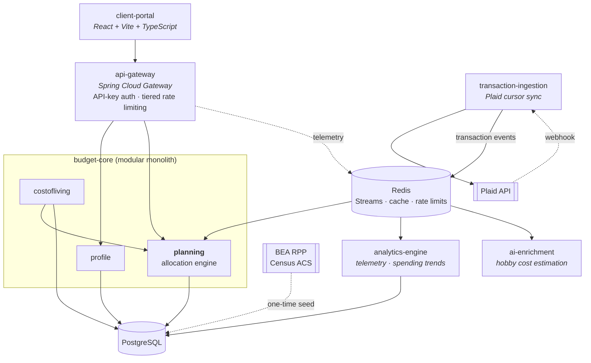
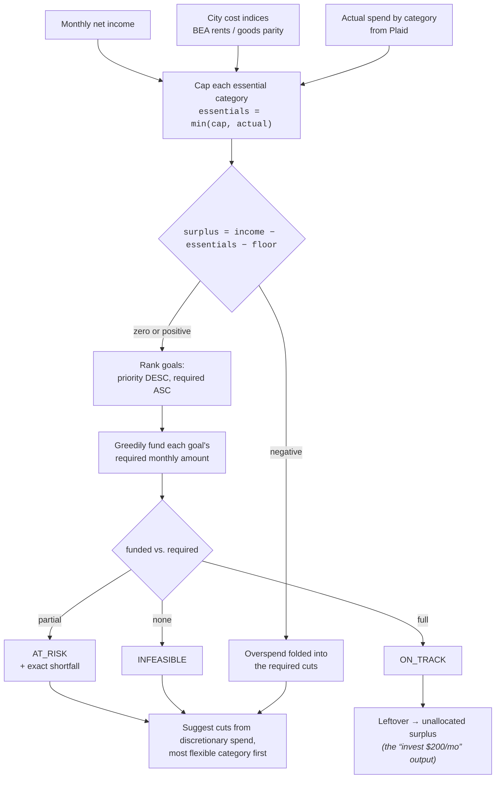

# Goal-Based Budget Planner

Tell it where you live, what you earn, and what you're saving for. It evaluates your money against
your **city's actual cost of living**, then computes a concrete monthly plan — and when you add a
goal ("I need $3,000 for a car in 5 months"), it recomputes everything and tells you exactly what
it would cost you elsewhere.

The interesting part isn't the CRUD. It's that allocating a finite surplus across goals with
competing deadlines and priorities is a real optimisation problem, and this solves it with a
provably optimal strategy rather than a hardcoded 50/30/20 rule.

---

## Architecture



### Why these boundaries

Every split has an operational reason; the relational core deliberately **stayed together**.

| Service | Why it is separate |
|---|---|
| `api-gateway` | Bank data makes real auth non-optional, and rate limiting protects downstream Plaid quota. Adapted from [jobs-tracker-distributed-system](https://github.com/hasanmahdi2007/jobs-tracker-distributed-system) — infrastructure should be reusable across products. |
| `budget-core` | **Not** split. Profile, goals, and plans are highly relational; separating them would buy distributed transactions in exchange for nothing. |
| `transaction-ingestion` | Plaid webhooks are genuinely asynchronous with a different scaling profile. Sync must never sit in a user request path. |
| `analytics-engine` | Read-mostly aggregation over an OLAP schema, consuming batched events rather than blocking writes. |
| `ai-enrichment` | LLM calls are slow, rate-limited, and cacheable. They need failure isolation. |

Redis Streams is the broker rather than Kafka — Kafka would be over-provisioned at this volume, and
Redis is already in the stack for caching and rate-limit buckets.

---

## The allocation engine



**Why greedy is correct here.** The surplus is a single *divisible, homogeneous* resource, so this
is not a multi-dimensional knapsack. For the objective *maximise the priority-weighted count of
goals kept on pace*, greedy allocation in this order is optimal by an exchange argument: given a
funded goal and an unfunded goal that outranks it, moving the funding to the higher-ranked goal
never reduces the priority-weighted count — so some optimal solution agrees with the greedy choice
at every step. Cost is `O(n log n)`, dominated by the sort.

**Why cheapest-first inside a priority tier.** Funding the largest requirement first starves several
small goals to serve one big one. With a $300 surplus and three equal-priority goals needing $100,
$150 and $300, cheapest-first keeps two on pace; largest-first keeps one.

**Where it stops being sufficient.** This solves one month in isolation. If expense categories
become hard non-fungible caps and goals compete across multiple constrained pools, it becomes
genuine LP territory — so the engine sits behind an `AllocationStrategy` interface and a
`LinearProgrammingAllocator` can be swapped in without touching callers.

### Correctness details that are easy to get wrong

- **Money is `BigDecimal`, never `double`.** `Money` normalises to scale 2 in its compact
  constructor, which is what makes the record's generated `equals()` behave — `BigDecimal.equals`
  is scale-sensitive, so `1.5` and `1.50` would otherwise be unequal.
- **Monthly requirements round up.** $1,000 over 3 months at $333.33 reaches $999.99 and misses the
  target, so `Money.spreadOver` rounds with `CEILING`.
- **A negative surplus is not the same as a zero surplus.** If essentials already exceed income, the
  suggested cuts must cover that overspend *on top of* whatever the goals are short.
- **The engine takes no clock.** The evaluation date arrives on the request, so every result is
  reproducible and every edge case is testable.

---

## Cost-of-living data

**v1 ships curated figures for about ten cities** — six in Lebanon, a few US metros — hand-researched,
committed as CSV, and seeded into Postgres via Flyway behind a `CostOfLivingProvider` port.

They are labelled **`CROWDSOURCED`, never `OFFICIAL`**. They are researched estimates, not statistics,
and every figure carries its source and an `as_of` date that the UI shows. The app's central claim on
your trust is that it never presents a guess as a fact; that has to apply to its own numbers first.
Any figure you correct yourself becomes `USER_PROVIDED` and outranks everything else, permanently.

**Deriving baselines from official statistics is deferred, not abandoned.** The original design built
them from BLS Consumer Expenditure Survey data localised by BEA Regional Price Parities, cross-checked
against Census ACS `B25064` median rent. It was cut from v1 deliberately: it bought one user-visible
sentence — *"your groceries are high for this city"* — for two to three days of work, and it carried an
unvalidated modelling risk in how survey categories map onto price-parity components.

The seams for it exist and are unused on purpose: the port, the `OFFICIAL` confidence tier, and an
empty `OFFICIAL` layer in the resolver chain. Reviving it is a new class implementing an existing
interface, touching no caller. The full specification — sources, formula, reference figures, and the
measurement that must run before any of it is trusted — is in
`.claude/packets/P9-DEFERRED-official-cost-of-living.md`.

That ordering is deliberate: get the product working, then let real use decide which sophistication
earns its place.

---

## The floor, and the tax trap

### What the plan is not allowed to cut

Every budgeting engine that optimises without a floor eventually says *"cut going out to $0, cut
eating out to $0"*. It is arithmetically correct and nobody follows it. So the plan carries a
**minimum the engine may not touch**, and the app **always asks you for it** — with the question
written for a person, not for a developer:

> **What is the least you would want to spend each month on enjoying life?**
> We will never suggest cutting below this, even to reach a goal faster.
>
> - Going out and fun — nights out, cinema, games, sports, hobbies
> - Eating out — restaurants, cafes, takeaway, snacks and coffee
> - Clothes — clothing, shoes and personal items
>
> *Suggested: $217.80 — typical for someone in Beirut who goes out regularly*

The suggestion is only a pre-filled default, for people who skip it. It is derived, not invented:

```
protected(category) = local baseline × tier share
floor               = Σ protected × obligation multiplier,  clamped to 3%–12% of net income
```

The tier share runs 25% for someone mostly at home to 55% for someone out most days — a *fraction*
of typical spending, because a floor equal to typical spending would make no cut possible anywhere.
The obligation multiplier then runs 1.15 down to 0.70 as the share of income already committed to
rent and loans rises past 40%, 55% and 70%: someone with little left after their fixed costs cannot
also protect a large lifestyle budget. The clamps bound both ends — the lower stops a heavily
indebted user being told to live on nothing, the upper stops the floor swallowing the surplus and
making every goal look infeasible.

**The stated approximation.** Where a city baseline exists, the floor scales with that city
automatically — the same policy row produces a Beirut figure in Beirut and a San Francisco figure in
San Francisco. Where one does not, it falls back to BLS Consumer Expenditure Survey 2024 national
shares of annual expenditure: entertainment 4.6%, food away from home 5.0%, apparel and services
2.5%. Those are shares of *expenditure*, and they are applied here to *net income*. Households spend
close to their net income, which makes the substitution reasonable — but it is a substitution, and it
belongs in the open rather than buried in a constant.

Every one of those numbers is a database row (`lifestyle_floor`, `floor_obligation_band`,
`discretionary_national_share`, `discretionary_floor_clamp`), so tuning the policy against real users
is an edit to data, not a redeploy. And your own answer overrides the computed figure outright — no
multiplier, neither clamp. You were asked a plain question about your own life.

### Why there is usually no tax line at all

Payroll deposits are **already net of tax**, and this app collects net income. Applying a tax rate on
top of that figure subtracts tax twice and quietly removes another fifth of money you actually have.
The mistake is invisible in testing — every number still adds up — and shows only as a plan that is
inexplicably pessimistic.

So one question at onboarding decides it. *Income arrives already taxed* (employed, the common case)
means **no tax line at all**, and the resolved rate is used only to explain the gross-to-net gap if
you ask. *Income arrives untaxed* (freelance, common in Lebanon) funds a tax reserve at the resolved
rate, locked, because a tax reserve is not something to offer you as a saving.

The rate resolves through the same ordered chain as a cost-of-living baseline — your own figure
first, then the seeded country estimate — and is stored as an **effective rate labelled
`ESTIMATED`**, never `OFFICIAL`. Real systems are progressive, with brackets and allowances; a single
percentage approximates one person's position in one, and presenting it as a statutory truth would be
the false precision the rest of the confidence model exists to prevent.

---

## Stack

Java 25 · Spring Boot 4.1 · PostgreSQL · Redis · Plaid (Sandbox) · React + Vite + TypeScript ·
Docker Compose · GitHub Actions

---

## Status

| Area | State |
|---|---|
| Allocation engine + domain model | Implemented, 26 unit tests |
| Cost-of-living ingestion and provider | Designed, not yet built |
| Plaid Link + cursor sync | Designed, not yet built |
| REST API and frontend | Not yet built |
| Gateway adaptation | Not yet built |
| `analytics-engine`, `ai-enrichment` | Later phases |

Known gaps, stated rather than hidden: no auth beyond a stub yet, no live deployment, no
multi-currency, and no pay-frequency modelling. Tax is a single effective rate, not a bracket model.

---

## Running it

```powershell
$env:JAVA_HOME = "C:\Program Files\Eclipse Adoptium\jdk-25.0.4.7-hotspot"
cd budget-core
& "$env:USERPROFILE\.m2\maven-dist\apache-maven-3.9.16\bin\mvn.cmd" --batch-mode test
```

Secrets (Plaid, BEA, Census keys) belong in `.env`, which is gitignored.
