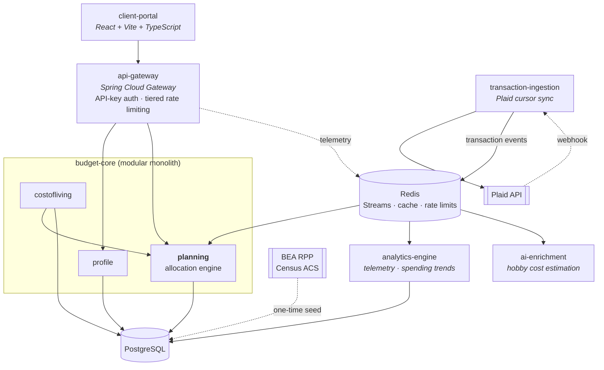
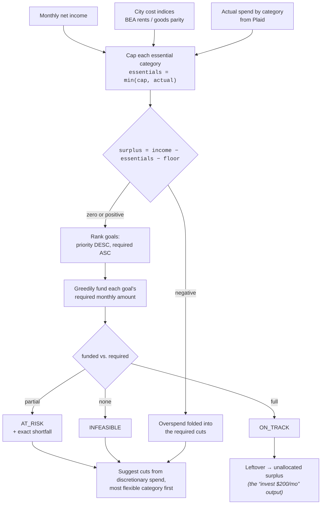

# Goal-Based Budget Planner

Tell it where you live, what you earn, and what you're saving for. It evaluates your money against
your **city's actual cost of living**, then computes a concrete monthly plan — and when you add a
goal ("I need $3,000 for a car in 5 months"), it recomputes everything and tells you exactly what
it would cost you elsewhere.

The interesting part isn't the CRUD. It's that allocating a finite surplus across goals with
competing deadlines and priorities is a real optimisation problem, and this solves it with a
provably optimal strategy rather than a hardcoded 50/30/20 rule.

---

## Architecture



### Why these boundaries

Every split has an operational reason; the relational core deliberately **stayed together**.

| Service | Why it is separate |
|---|---|
| `api-gateway` | Bank data makes real auth non-optional, and rate limiting protects downstream Plaid quota. Adapted from [jobs-tracker-distributed-system](https://github.com/hasanmahdi2007/jobs-tracker-distributed-system) — infrastructure should be reusable across products. |
| `budget-core` | **Not** split. Profile, goals, and plans are highly relational; separating them would buy distributed transactions in exchange for nothing. |
| `transaction-ingestion` | Plaid webhooks are genuinely asynchronous with a different scaling profile. Sync must never sit in a user request path. |
| `analytics-engine` | Read-mostly aggregation over an OLAP schema, consuming batched events rather than blocking writes. |
| `ai-enrichment` | LLM calls are slow, rate-limited, and cacheable. They need failure isolation. |

Redis Streams is the broker rather than Kafka — Kafka would be over-provisioned at this volume, and
Redis is already in the stack for caching and rate-limit buckets.

---

## The allocation engine



**Why greedy is correct here.** The surplus is a single *divisible, homogeneous* resource, so this
is not a multi-dimensional knapsack. For the objective *maximise the priority-weighted count of
goals kept on pace*, greedy allocation in this order is optimal by an exchange argument: given a
funded goal and an unfunded goal that outranks it, moving the funding to the higher-ranked goal
never reduces the priority-weighted count — so some optimal solution agrees with the greedy choice
at every step. Cost is `O(n log n)`, dominated by the sort.

**Why cheapest-first inside a priority tier.** Funding the largest requirement first starves several
small goals to serve one big one. With a $300 surplus and three equal-priority goals needing $100,
$150 and $300, cheapest-first keeps two on pace; largest-first keeps one.

**Where it stops being sufficient.** This solves one month in isolation. If expense categories
become hard non-fungible caps and goals compete across multiple constrained pools, it becomes
genuine LP territory — so the engine sits behind an `AllocationStrategy` interface and a
`LinearProgrammingAllocator` can be swapped in without touching callers.

### Correctness details that are easy to get wrong

- **Money is `BigDecimal`, never `double`.** `Money` normalises to scale 2 in its compact
  constructor, which is what makes the record's generated `equals()` behave — `BigDecimal.equals`
  is scale-sensitive, so `1.5` and `1.50` would otherwise be unequal.
- **Monthly requirements round up.** $1,000 over 3 months at $333.33 reaches $999.99 and misses the
  target, so `Money.spreadOver` rounds with `CEILING`.
- **A negative surplus is not the same as a zero surplus.** If essentials already exceed income, the
  suggested cuts must cover that overspend *on top of* whatever the goals are short.
- **The engine takes no clock.** The evaluation date arrives on the request, so every result is
  reproducible and every edge case is testable.

---

## Cost-of-living data

**v1 ships curated figures for about ten cities** — six in Lebanon, a few US metros — hand-researched,
committed as CSV, and seeded into Postgres via Flyway behind a `CostOfLivingProvider` port.

They are labelled **`CROWDSOURCED`, never `OFFICIAL`**. They are researched estimates, not statistics,
and every figure carries its source and an `as_of` date that the UI shows. The app's central claim on
your trust is that it never presents a guess as a fact; that has to apply to its own numbers first.
Any figure you correct yourself becomes `USER_PROVIDED` and outranks everything else, permanently.

**Deriving baselines from official statistics is deferred, not abandoned.** The original design built
them from BLS Consumer Expenditure Survey data localised by BEA Regional Price Parities, cross-checked
against Census ACS `B25064` median rent. It was cut from v1 deliberately: it bought one user-visible
sentence — *"your groceries are high for this city"* — for two to three days of work, and it carried an
unvalidated modelling risk in how survey categories map onto price-parity components.

The seams for it exist and are unused on purpose: the port, the `OFFICIAL` confidence tier, and an
empty `OFFICIAL` layer in the resolver chain. Reviving it is a new class implementing an existing
interface, touching no caller. The full specification — sources, formula, reference figures, and the
measurement that must run before any of it is trusted — is in
`.claude/packets/P9-DEFERRED-official-cost-of-living.md`.

That ordering is deliberate: get the product working, then let real use decide which sophistication
earns its place.

### User-contributed figures, and what "crowdsourced" does not mean here

**There is no crowd.** A figure you type applies to your own plan immediately and is visible to
nobody else. Sharing it is a separate opt-in step, and a shared figure becomes a city default only
after it passes validation **and** is approved by hand — never one without the other.

Of the four validators the design calls for, **one is built**: bank corroboration, which compares
your claim against your own transactions. It is the only one that works with a single user, and it is
also the strongest, because it checks a claim against evidence rather than against opinion. Alongside
it runs a plausibility band per category, which is what catches a rent figure typed into the
groceries box.

**Quorum and outlier rejection are designed and not built** — require *k* submissions, take the
median, reject anything beyond three times the median absolute deviation. They are meaningless at one
user, so they are specified and switched off rather than faked. When there are enough submissions to
make them mean something, turning them on is adding a check to a battery that already exists.

The `CROWDSOURCED` label on the curated figures therefore means *"researched by us"*, not *"agreed by
residents"*. The interface says exactly that; the constant name never reaches a user.

---

## Stack

Java 25 · Spring Boot 4.1 · PostgreSQL · Redis · Plaid (Sandbox) · React + Vite + TypeScript ·
Docker Compose · GitHub Actions

---

## Status

| Area | State |
|---|---|
| Allocation engine + domain model | Implemented, 26 unit tests |
| Cost-of-living schema, curated data, resolver and catalogue | Implemented; two provider adapters held to one contract test |
| Official (BLS/BEA/Census) baseline derivation | Deferred out of v1 — see above |
| Plaid Link + cursor sync | Designed, not yet built |
| REST API and frontend | Not yet built |
| Gateway adaptation | Not yet built |
| `analytics-engine`, `ai-enrichment` | Later phases |

Known gaps, stated rather than hidden: no auth beyond a stub yet, no live deployment, no
multi-currency, and no tax or pay-frequency modelling.

---

## Running it

```powershell
$env:JAVA_HOME = "C:\Program Files\Eclipse Adoptium\jdk-25.0.4.7-hotspot"
cd budget-core
& "$env:USERPROFILE\.m2\maven-dist\apache-maven-3.9.16\bin\mvn.cmd" --batch-mode test
```

Secrets (Plaid, BEA, Census keys) belong in `.env`, which is gitignored.
